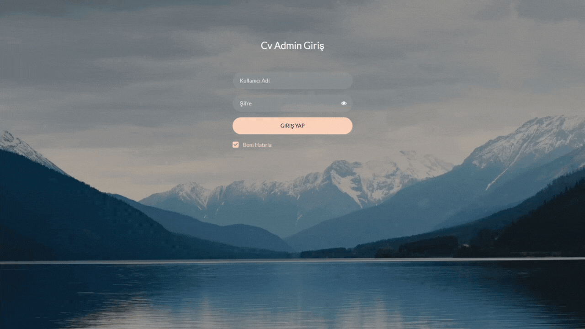

# MyCvProjectASP

ASP.NET MVC5 tasarım desenine dayalı olarak geliştirdiğim dinamik CV sitesi. Bu proje üç ana panelden (vitrin, admin ve login) oluşmaktadır. 

Ön tarafta html, css ve boostrap kullanılarak modern ve kullanıcı dostu bir arayüze yer verildi. Admin paneliyle özelleştirilebilen bu sitedeki tüm bilgiler dinamik olarak Microsoft SQL Server veritabanından alınmaktadır. Entity Framework Database First ile kurulan bağlantıya ek olarak Admin tarafında Repository Design Pattern kullanarak veri erişimini standartlaştırıp, kodun daha modüler ve yönetilebilir olmasını sağladım. 

Proje klasöründeki CvDb.bak dosyası ile MSSQL veritabanını içe aktardıktan sonra Web.config dosyasındaki connection string'i düzenleyerek projeyi localinizde ayağa kaldırabilirsiniz. Profil fotoğrafı ve özgeçmiş dosyalarını değiştirmek için proje ana dizinindeki "profile.jpg" ve "Ozgecmisim.pdf" dosyalarını aynı isimleriyle değiştirmeniz yeterli.

Projeyi aynı zamanda kendi CV'im için canlıda kullanıyorum: https://burakarslan.me

## MyCvProjectASP Ana Sayfa

## MyCvProjectASP Login ve Admin Panel

